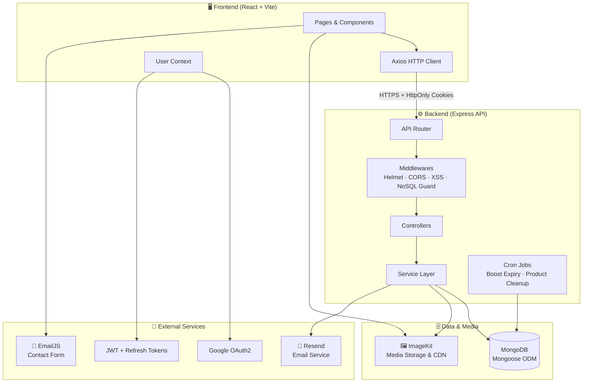

<div align="center">

<p align="center">
  
</p>

<h1 align="center">Unideals</h1>

<p>
  <a href="#"></a>
  <a href="#"></a>
  <a href="#"></a>
  <a href="#"></a>
  <a href="#"></a>
  <a href="#"></a>
</p>

<p>
  <a href="#"></a>
  <a href="#"></a>
  <a href="#"></a>
  <a href="#"></a>
</p>

<br/>

**Unideals** is a full-stack student marketplace for buying, selling, and discovering products within a campus community.

</div>

## 📋 Table of Contents

- [Overview](#-overview)
- [Tech Stack](#-tech-stack)
- [Project Structure](#-project-structure)
- [System Architecture](#-system-architecture)
- [API Reference](#-api-reference)
- [Frontend Routes](#-frontend-routes)
- [Environment Variables](#-environment-variables)
- [Getting Started](#-getting-started)
- [Security](#-security)
- [License](#-license)

## 🌟 Overview

Unideals connects students in a campus marketplace. Users can register, verify their email, list products, browse and search listings, save favourites, manage addresses, report listings or users, and boost product visibility based on subscription tier.

**Key highlights:**

- 🔐 **Authentication** — JWT access tokens with HttpOnly refresh cookies, email verification, password reset, and Google OAuth2
- 📦 **Product lifecycle** — Multi-step listing flow, drafts, search, category/price/condition filters, unlist/relist, soft delete, and boosted listings
- ❤️ **Wishlist & addresses** — Save favourite products and manage delivery/meetup addresses
- 🚨 **Reporting** — Flag inappropriate products or users
- 🖼️ **ImageKit media** — Signed upload tokens on the backend; client-side image upload and compression
- 👤 **Admin API** — Separate admin auth and moderation endpoints for users and products
- 🛡️ **Security-first** — Helmet, CORS, XSS filtering, NoSQL injection guards, and rate limiting on product creation


## 🛠️ Tech Stack

### Frontend

| Technology | Purpose |
|---|---|
| **React 18** | UI framework |
| **Vite** | Dev server and production bundler |
| **React Router v7** | Client-side routing with protected layouts |
| **Axios** | HTTP client with auth interceptors and token refresh |
| **Tailwind CSS** | Utility-first styling |
| **ImageKit JavaScript SDK** | Client-side image uploads |
| **EmailJS** | Contact form email delivery |
| **Framer Motion, Swiper, Radix UI** | UI animations, carousels, and dialogs |

### Backend

| Technology | Purpose |
|---|---|
| **Express.js 5** | REST API server |
| **MongoDB + Mongoose** | Document database and ODM |
| **JWT + Refresh Tokens** | Cookie-based session authentication |
| **Zod** | Request body validation |
| **Resend** | Transactional email (verification, password reset) |
| **ImageKit** | Image storage, delivery, and server-side deletion |
| **Google OAuth2** | Social sign-in |
| **node-cron** | Scheduled jobs (boost expiry, deleted product cleanup) |
| **bcrypt** | Password hashing |


## 📁 Project Structure

```
Campus-Mart/
├── frontend/                         # React + Vite client
│   ├── src/
│   │   ├── app/                      # App entry, routes
│   │   ├── features/                 # Feature modules
│   │   │   ├── auth/                 # Login, signup, password reset, Google OAuth
│   │   │   ├── product/              # Home, listing, product detail, categories
│   │   │   ├── user/                 # Profile, settings, wishlist, contact
│   │   │   ├── search/               # Search results and dropdown suggestions
│   │   │   ├── chat/                 # Chat page UI
│   │   │   ├── notification/         # Notifications page UI
│   │   │   └── legal/                # Privacy policy
│   │   ├── Components/               # Shared layout and UI components
│   │   ├── Layouts/                  # MainLayout, ProtectedLayout
│   │   ├── context/                  # User, theme, and wishlist state
│   │   ├── services/                 # Axios instance and auth interceptor
│   │   ├── styles/                   # Global CSS
│   │   └── utils/                    # Image upload helpers
│   ├── public/
│   ├── .env.sample
│   └── vite.config.js
│
├── backend/                          # Express + MongoDB API
│   ├── src/
│   │   ├── config/                   # DB, constants, email, boost plans
│   │   ├── controllers/              # Route handlers
│   │   ├── models/                   # Mongoose schemas
│   │   ├── routes/                   # API route definitions
│   │   ├── middlewares/              # Auth, roles, validation, errors
│   │   ├── services/                 # Business logic
│   │   ├── validations/              # Zod schemas
│   │   ├── jobs/                     # Cron jobs
│   │   └── utils/                    # Tokens, ImageKit, email templates
│   ├── .env.sample
│   └── server.js
│
└── Readme.md
```


## 🏗️ System Architecture




## 📡 API Reference

All API routes are prefixed with the base URL configured via `VITE_API_BASE_URL`.

### Auth — `/api/auth`

| Method | Endpoint | Description | Access |
|---|---|---|---|
| `POST` | `/register` | Create new account | Public |
| `POST` | `/login` | Local login | Public |
| `GET` | `/logoutUser` | Clear auth cookies and invalidate refresh token | Public |
| `POST` | `/refresh-token` | Rotate access token using refresh cookie | Public |
| `POST` | `/verify-email` | Verify email address | Public |
| `GET` | `/check-verification` | Check email verification status | Public |
| `POST` | `/resend-verification` | Resend verification email | Public |
| `POST` | `/forgot-password` | Send password reset email | Public |
| `GET` | `/reset-password/:token` | Validate reset token before form submit | Public |
| `POST` | `/reset-password/:token` | Reset user password | Public |
| `GET` | `/google` | Initiate Google OAuth redirect | Public |
| `GET` | `/google/callback` | OAuth callback handler | Public |
| `POST` | `/google/exchange` | Exchange OAuth code for session | Public |

### User — `/api/user` 🔒

| Method | Endpoint | Description |
|---|---|---|
| `GET` | `/userProfile` | Get authenticated user profile |
| `PUT` | `/updateProfile` | Update profile details |
| `DELETE` | `/deleteAccount` | Delete user account |

### Product — `/api/product`

| Method | Endpoint | Description | Access |
|---|---|---|---|
| `GET` | `/` | List products (supports `page`, `limit`, `search`, `category`, `condition`, `min_price`, `max_price`, `sort`) | Public |
| `GET` | `/boosted` | List currently boosted products | Public |
| `GET` | `/search` | Full-text product search (`q`) | Public |
| `GET` | `/search-suggestions` | Autocomplete suggestions (`q`, min 2 chars) | Public |
| `GET` | `/:id` | Get product by ID | Public |
| `POST` | `/` | Create product listing or draft | Protected |
| `DELETE` | `/:id` | Soft-delete a listing | Protected |
| `PATCH` | `/:id/unlist` | Unlist a product | Protected |
| `PATCH` | `/:id/relist` | Relist a product | Protected |
| `GET` | `/user/my-products` | Get current user's listed products | Protected |
| `GET` | `/user/drafts` | Get current user's draft products | Protected |

### Wishlist — `/api/wishlist` 🔒

| Method | Endpoint | Description |
|---|---|---|
| `GET` | `/` | Get user's wishlist |
| `POST` | `/add` | Add product to wishlist |
| `POST` | `/remove` | Remove product from wishlist |
| `POST` | `/toggle` | Toggle wishlist state |
| `GET` | `/check/:productId` | Check if product is in wishlist |

### Address — `/api/address` 🔒

| Method | Endpoint | Description |
|---|---|---|
| `POST` | `/` | Create address |
| `GET` | `/` | List user addresses |
| `GET` | `/:addressId` | Get address by ID |
| `PUT` | `/:addressId` | Update address |
| `DELETE` | `/:addressId` | Delete address |
| `PATCH` | `/:addressId/default` | Set default address |

### Report — `/api/report` 🔒

| Method | Endpoint | Description |
|---|---|---|
| `POST` | `/product/:productId` | Report a product |
| `POST` | `/user/:userId` | Report a user |

### Boost — `/api/boost` 🔒

| Method | Endpoint | Description |
|---|---|---|
| `GET` | `/me/summary` | Get current user's boost usage summary |
| `POST` | `/products/:productId` | Boost a product listing |

### ImageKit — `/api/imagekit` 🔒

| Method | Endpoint | Description |
|---|---|---|
| `GET` | `/auth` | Get signed upload parameters |

### Admin — `/api/admin`

| Method | Endpoint | Description | Access |
|---|---|---|---|
| `POST` | `/auth/login` | Admin login | Public |
| `POST` | `/auth/refresh-token` | Refresh admin session | Public |
| `GET` | `/auth/me` | Get current admin user | Admin / Support |
| `POST` | `/auth/logout` | Admin logout | Admin / Support |
| `GET` | `/users` | List users | Admin / Support |
| `PATCH` | `/users/:id/status` | Update user status | Admin / Support |
| `GET` | `/products` | List products for moderation | Admin / Support |
| `PATCH` | `/products/:id/status` | Update product status | Admin / Support |
| `PATCH` | `/products/:id/soft-delete` | Soft-delete a product | Admin / Support |
| `DELETE` | `/products/:id` | Hard-delete a product | Admin / Support |

### Health

| Method | Endpoint | Description |
|---|---|---|
| `GET` | `/health` | Server health check |


## 🗺️ Frontend Routes

### Auth Routes (no header)

```
/login                     → Sign in
/signup                    → Create account
/forgot-password           → Request password reset
/reset-password/:token     → Set new password
/verify-email              → Email verification
/checkEmail                → Post-signup email confirmation prompt
```

### Public Routes (with header)

```
/                          → Home / product feed
/search                    → Search results
/product/:id               → Product detail page
/category/:categoryName    → Category browser (also supports boosted-products)
/price                     → Price range filter view
/termscondition            → Terms & conditions
/privacy-policy            → Privacy policy
```

### Protected Routes 🔒 (with header)

```
/profile                   → User profile overview
/settings                  → Account settings
/subscription              → Subscription plans UI
/wishlist                  → Saved listings
/myorders                  → Order history UI
/chat                      → Messaging UI
/notification              → Activity notifications UI
/upload                    → Create a new listing (multi-step)
/productlisted             → Post-listing confirmation
/contact                   → Contact support
```

Legacy redirects: `/profileoverview` → `/profile`, `/setting` → `/settings`.


## 🔧 Environment Variables

### Backend — `backend/.env`

Copy from `backend/.env.sample`:

```env
PORT=5000
NODE_ENV=development
FRONTEND_URL=http://localhost:5173
ADMIN_FRONTEND_URL=http://localhost:5174

MONGO_URL=mongodb+srv://<user>:<password>@cluster.mongodb.net/campus-mart

SECRET_KEY_ACCESS_TOKEN=your_access_token_secret
SECRET_KEY_REFRESH_TOKEN=your_refresh_token_secret

GOOGLE_CLIENT_ID=your_google_client_id
GOOGLE_CLIENT_SECRET=your_google_client_secret
GOOGLE_REDIRECT_URI=http://localhost:5000/api/auth/google/callback

IMAGEKIT_PUBLIC_KEY=your_imagekit_public_key
IMAGEKIT_PRIVATE_KEY=your_imagekit_private_key
IMAGEKIT_URL_ENDPOINT=https://ik.imagekit.io/your_id

RESEND_API_KEY=your_resend_api_key
```

### Frontend — `frontend/.env`

Copy from `frontend/.env.sample`:

```env
VITE_API_BASE_URL=http://localhost:5000
VITE_IMAGEKIT_PUBLIC_KEY=your_imagekit_public_key
VITE_IMAGEKIT_URL_ENDPOINT=https://ik.imagekit.io/your_id

VITE_EMAILJS_SERVICE_ID=your_emailjs_service_id
VITE_EMAILJS_TEMPLATE_ID=your_emailjs_template_id
VITE_EMAILJS_PUBLIC_KEY=your_emailjs_public_key
VITE_SUPPORT_EMAIL=support@example.com
```

> ⚠️ **Never commit `.env` files.** Use the `.env.sample` files as templates.


## 🚀 Getting Started

### Prerequisites

- **Node.js** ≥ 18.0.0
- **npm** ≥ 9.0.0
- **MongoDB** instance (local or Atlas)
- Accounts for: ImageKit, Resend, Google Cloud Console, EmailJS

### 1 · Clone the repository

```bash
git clone https://github.com/Imaginum-org/Campus-Mart.git
cd Campus-Mart
```

### 2 · Set up the backend

```bash
cd backend
cp .env.sample .env        # Fill in your environment variables
npm install
npm run dev                # Starts on http://localhost:5000
```

### 3 · Set up the frontend

```bash
cd ../frontend
cp .env.sample .env        # Fill in your environment variables
npm install
npm run dev                # Starts on http://localhost:5173
```

### 4 · Open in your browser

```
Frontend   →  http://localhost:5173
API Health →  http://localhost:5000/health
```


## 🛡️ Security

Unideals uses a layered security model:

| Layer | Implementation |
|---|---|
| **Transport** | CORS restricted to configured frontend and admin origins |
| **Authentication** | Short-lived JWT access tokens in cookies or Bearer header; HttpOnly refresh token cookies |
| **Authorization** | Auth middleware on protected routes; role middleware for admin endpoints |
| **Input validation** | Zod schemas on validated request bodies |
| **XSS protection** | `xss` sanitization on string body and route params |
| **NoSQL injection** | Request body/param key sanitization against `$` and `.` operators |
| **Rate limiting** | Per-IP throttling on product creation (5 requests/minute) |
| **HTTP hardening** | Helmet sets secure response headers |
| **Media** | Signed ImageKit upload tokens; private ImageKit keys kept server-side |


## 📄 License

Distributed under the **ISC License** (see `package.json` in `backend/` and `frontend/`).

<div align="center">


<p>Built with ❤️ for campus communities everywhere by <b><a href="https://imaginumorg.vercel.app/">Team Imaginum</a></b></p>

<p>
  <a href="#">⬆ Back to top</a>
</p>

</div>
