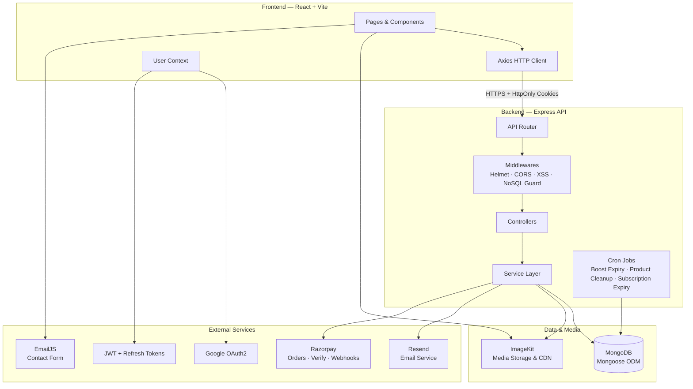

<div align="center">


# Unideals

**A full-stack student marketplace for buying, selling, and discovering products within a campus community.**

<p>
  
  
  
  
  
  
</p>
<p>
  
  
  
</p>

</div>

---

## Table of Contents

- [Overview](#overview)
- [Tech Stack](#tech-stack)
- [Project Structure](#project-structure)
- [System Architecture](#system-architecture)
- [API Reference](#api-reference)
- [Frontend Routes](#frontend-routes)
- [Configuration](#configuration)
- [Getting Started](#getting-started)
- [Security](#security)
- [License](#license)

---

## Overview

Unideals connects students in a campus marketplace. Users can register, verify their email, list products, browse and search listings, save favourites, manage campus pickup spots, report listings or users, and boost product visibility. Paid tiers (Pro / Pro+) and one-time boost add-ons are sold through Razorpay, with listing, wishlist, and boost quotas enforced per plan.

**Highlights**

| Area | Description |
|---|---|
| Authentication | Short-lived (15 min) JWT access tokens with HttpOnly refresh cookies, session revocation, email verification, password reset, and Google OAuth2 + One-Tap |
| Product lifecycle | Multi-step listing flow, drafts, search, category/price/condition filters, unlist/relist, soft delete, and boosted listings |
| Wishlist & pickup spots | Save favourite products (plan-capped) and manage up to 3 campus pickup spots; listings snapshot the chosen spot |
| Payments & plans | Razorpay checkout for Pro / Pro+ Founder lifetime plans and one-time 3-day / 7-day boost add-ons; HMAC-verified payments with idempotent activation and webhooks |
| Reporting | Flag inappropriate products or users |
| Media | Signed ImageKit upload tokens on the backend; client-side image upload (JPG/PNG/WEBP) and compression |
| Admin console | Separate admin authentication and moderation endpoints for users and products |
| Security | Helmet, CORS, deep XSS filtering, NoSQL injection guards, and rate limiting on auth, product creation, and payments |

---

## Tech Stack

**Frontend**

| Technology | Purpose |
|---|---|
| React 18 | UI framework |
| Vite | Dev server and production bundler |
| React Router v7 | Client-side routing with protected layouts |
| Axios | HTTP client with cookie-based auth and silent token refresh |
| Tailwind CSS | Utility-first styling |
| ImageKit JS SDK | Client-side image uploads |
| Razorpay Checkout | Pro / Pro+ upgrades and boost add-on purchases |
| EmailJS | Contact form email delivery |
| Framer Motion, Swiper, Radix UI | Animations, carousels, and dialogs |

**Backend**

| Technology | Purpose |
|---|---|
| Express.js 5 | REST API server |
| MongoDB + Mongoose | Document database and ODM |
| JWT + refresh tokens | Cookie-based session authentication |
| Zod | Request body validation |
| Resend | Transactional email (verification, password reset) |
| ImageKit | Image storage, delivery, and server-side deletion |
| Razorpay | Plan and boost add-on orders, signature verification, webhooks |
| Google OAuth2 | Social sign-in |
| node-cron | Scheduled jobs (boost expiry, deleted product cleanup, subscription expiry) |
| bcrypt | Password hashing |

---

## Project Structure

```
Unideals/
├── frontend/                    React + Vite client
│   ├── src/
│   │   ├── app/                 App entry, routes
│   │   ├── features/            Feature modules
│   │   │   ├── auth/            Login, signup, password reset, Google OAuth
│   │   │   ├── product/         Home, listing, product detail, categories, pricing
│   │   │   ├── user/            Profile, settings, wishlist, subscription, contact
│   │   │   ├── payment/         Razorpay checkout hook and billing API client
│   │   │   ├── search/          Search results and dropdown suggestions
│   │   │   ├── chat/            Chat page UI
│   │   │   ├── notification/    Notifications page UI
│   │   │   └── legal/           Privacy policy
│   │   ├── Components/          Shared layout and UI components
│   │   ├── Layouts/             MainLayout, ProtectedLayout
│   │   ├── context/             User, theme, and wishlist state
│   │   ├── services/            Axios instance and auth interceptor
│   │   ├── styles/               Global CSS
│   │   └── utils/                Image upload helpers
│   └── public/
│
├── backend/                     Express + MongoDB API
│   ├── src/
│   │   ├── config/               DB, constants, email, subscription and boost plans
│   │   ├── controllers/          Route handlers
│   │   ├── models/                Mongoose schemas (User, Product, Payment, Subscription, ...)
│   │   ├── routes/                API route definitions
│   │   ├── middlewares/           Auth, roles, tiers, validation, errors
│   │   ├── services/              Business logic (auth, product, payments, subscriptions, ...)
│   │   ├── validations/           Zod schemas
│   │   ├── jobs/                   Cron jobs (boosts, product cleanup, subscriptions)
│   │   ├── seeds/                  Plan catalog self-check script
│   │   └── utils/                  Tokens, ImageKit, Razorpay, email templates
│   └── server.js
│
├── Subscription_plan.md           Plan pricing and monetization spec
├── fix.md                         Security and feature fix log
└── README.md
```

---

## System Architecture


```mermaid
flowchart TB
    subgraph Client ["Frontend — React + Vite"]
        UI[Pages & Components]
        Axios[Axios HTTP Client]
        UserCtx[User Context]
    end

    subgraph Server ["Backend — Express API"]
        Router[API Router]
        MW["Middlewares
Helmet · CORS · XSS · NoSQL Guard"]
        Controllers[Controllers]
        Services[Service Layer]
        Jobs["Cron Jobs
Boost Expiry · Product Cleanup · Subscription Expiry"]
    end

    subgraph Data ["Data & Media"]
        MongoDB[(MongoDB
Mongoose ODM)]
        ImageKit[ImageKit
Media Storage & CDN]
    end

    subgraph External ["External Services"]
        JWT[JWT + Refresh Tokens]
        Google[Google OAuth2]
        Razorpay[Razorpay
Orders · Verify · Webhooks]
        Resend[Resend
Email Service]
        EmailJS[EmailJS
Contact Form]
    end

    UI --> Axios
    Axios -->|HTTPS + HttpOnly Cookies| Router
    Router --> MW --> Controllers --> Services
    Services --> MongoDB
    Services --> ImageKit
    Services --> Resend
    Services --> Razorpay
    Jobs --> MongoDB
    UserCtx --> Google
    UserCtx --> JWT
    UI --> ImageKit
    UI --> EmailJS
```

---

## API Reference

All routes are prefixed with the base URL configured via `VITE_API_BASE_URL`.

### Auth — `/api/auth`

| Method | Endpoint | Description | Access |
|---|---|---|---|
| POST | `/register` | Create new account | Public |
| POST | `/login` | Local login | Public |
| POST | `/logoutUser` | Clear auth cookies and invalidate refresh token (GET kept for legacy clients) | Protected (GET: Public, revokes via cookie) |
| POST | `/refresh-token` | Rotate access token using refresh cookie | Public |
| POST | `/verify-email` | Verify email address | Public |
| GET | `/check-verification` | Check email verification status | Public |
| POST | `/resend-verification` | Resend verification email | Public |
| POST | `/forgot-password` | Send password reset email | Public |
| GET | `/reset-password/:token` | Validate reset token before form submit | Public |
| POST | `/reset-password/:token` | Reset user password | Public |
| GET | `/google` | Initiate Google OAuth redirect | Public |
| GET | `/google/callback` | OAuth callback handler | Public |
| POST | `/google/exchange` | Exchange OAuth code for session | Public |
| POST | `/google/one-tap` | Google One-Tap sign-in | Public |

### User — `/api/user` (Protected)

| Method | Endpoint | Description |
|---|---|---|
| GET | `/userProfile` | Get authenticated user profile |
| PUT | `/updateProfile` | Update profile details (mobile, gender) |
| PUT | `/updateAvatar` | Update profile photo (ImageKit URL + fileId) |
| DELETE | `/removeAvatar` | Remove profile photo |
| DELETE | `/deleteAccount` | Deactivate account (listings unlisted, sessions revoked) |

### Product — `/api/product`

| Method | Endpoint | Description | Access |
|---|---|---|---|
| GET | `/` | List products (`page`, `limit`, `search`, `category`, `condition`, `min_price`, `max_price`, `sort`) | Public |
| GET | `/boosted` | List currently boosted products | Public |
| GET | `/search` | Full-text product search (`q`) | Public |
| GET | `/search-suggestions` | Autocomplete suggestions (`q`, min 2 chars) | Public |
| GET | `/:id` | Get product by ID | Public |
| POST | `/` | Create product listing or draft | Protected |
| DELETE | `/:id` | Soft-delete a listing | Protected |
| PATCH | `/:id/unlist` | Unlist a product | Protected |
| PATCH | `/:id/relist` | Relist a product | Protected |
| GET | `/user/my-products` | Get current user's listed products | Protected |
| GET | `/user/drafts` | Get current user's draft products | Protected |

### Wishlist — `/api/wishlist` (Protected)

| Method | Endpoint | Description |
|---|---|---|
| GET | `/` | Get user's wishlist |
| POST | `/add` | Add product to wishlist |
| POST | `/remove` | Remove product from wishlist |
| POST | `/toggle` | Toggle wishlist state |
| GET | `/check/:productId` | Check if product is in wishlist |

### Pickup Spots — `/api/pickup-spots` (Protected)

Campus meetup spots (max 3 per user). Listings snapshot the selected spot, so no street address is needed.

| Method | Endpoint | Description |
|---|---|---|
| POST | `/` | Create pickup spot |
| GET | `/` | List user pickup spots |
| PUT | `/:pickupSpotId` | Update pickup spot |
| DELETE | `/:pickupSpotId` | Delete pickup spot |
| PATCH | `/:pickupSpotId/primary` | Set default pickup spot |

### Report — `/api/report` (Protected)

| Method | Endpoint | Description |
|---|---|---|
| POST | `/product/:productId` | Report a product |
| POST | `/user/:userId` | Report a user |

### Boost — `/api/boost` (Protected)

Quota boosts follow the active plan (Free 0, Pro 2 × 3 days, Pro+ 5 × 7 days per month).

| Method | Endpoint | Description |
|---|---|---|
| GET | `/me/summary` | Get current user's boost usage summary |
| POST | `/products/:productId` | Boost a product listing (quota) |

### Payments — `/api/payments`

Razorpay checkout for Founder lifetime plans (Pro ₹99, Pro+ ₹199) and one-time boost add-ons (3-day ₹29, 7-day ₹49, any tier). Amounts are always computed server-side from the plan catalog.

| Method | Endpoint | Description | Access |
|---|---|---|---|
| POST | `/orders` | Create order (`plan`, plus `productId` for boost add-ons); reuses a fresh unpaid order | Protected |
| POST | `/verify` | Verify HMAC signature and activate plan / apply boost | Protected |
| GET | `/me` | Current tier, plan, live usage, and payment history (powers the Subscription tab) | Protected |
| POST | `/webhook` | Razorpay event webhook (`payment.captured`, `payment.failed`); HMAC over raw body, no auth | Public (signature-verified) |

### ImageKit — `/api/imagekit` (Protected)

| Method | Endpoint | Description |
|---|---|---|
| GET | `/auth` | Get signed upload parameters |

### Admin — `/api/admin`

| Method | Endpoint | Description | Access |
|---|---|---|---|
| POST | `/auth/login` | Admin login | Public |
| POST | `/auth/refresh-token` | Refresh admin session | Public |
| GET | `/auth/me` | Get current admin user | Admin / Support |
| POST | `/auth/logout` | Admin logout | Admin / Support |
| GET | `/users` | List users | Admin / Support |
| PATCH | `/users/:id/status` | Update user status | Admin / Support |
| GET | `/products` | List products for moderation | Admin / Support |
| PATCH | `/products/:id/status` | Update product status | Admin / Support |
| PATCH | `/products/:id/soft-delete` | Soft-delete a product | Admin only |
| DELETE | `/products/:id` | Hard-delete a product | Admin only |

### Health

| Method | Endpoint | Description |
|---|---|---|
| GET | `/health` | Server health check |

---

## Frontend Routes

**Auth (no header, logged-in users are redirected home)**

```
/login                     Sign in
/signup                    Create account
/forgot-password           Request password reset
/reset-password/:token     Set new password
/verify-email              Email verification
/checkEmail                Post-signup email confirmation prompt
```

**Public (with header)**

```
/                          Home / product feed
/search                    Search results
/product/:id               Product detail page
/category/:categoryName    Category browser (includes boosted products)
/price                     Plans & pricing (Pro / Pro+ checkout)
/termscondition            Terms & conditions
/privacy-policy            Privacy policy
```

**Protected (with header)**

```
/profile                   User profile overview
/settings                  Account settings (incl. pickup spots)
/subscription              Subscription status, usage, and billing
/wishlist                  Saved listings
/myorders                  Order history
/chat                      Messaging
/notification              Activity notifications
/upload                    Create a new listing (multi-step)
/productlisted             My listings dashboard (incl. boost / buy extra boost)
/contact                   Contact support
```

Legacy redirects: `/profileoverview` → `/profile`, `/setting` → `/settings`. Unknown paths redirect to `/`.

---

## Configuration

Both services are configured via environment variables. Copy `.env.sample` to `.env` in each directory and populate the values before running the app. **Never commit `.env` files.**

**Backend (`backend/.env`)**

| Variable | Description |
|---|---|
| `PORT` | API server port |
| `NODE_ENV` | Runtime environment |
| `FRONTEND_URL` | Allowed origin for the main client |
| `ADMIN_FRONTEND_URL` | Allowed origin for the admin client |
| `MONGO_URL` | MongoDB connection string |
| `SECRET_KEY_ACCESS_TOKEN` | JWT access token signing secret |
| `SECRET_KEY_REFRESH_TOKEN` | JWT refresh token signing secret |
| `GOOGLE_CLIENT_ID` / `GOOGLE_CLIENT_SECRET` | Google OAuth2 credentials |
| `GOOGLE_REDIRECT_URI` | OAuth callback URL |
| `IMAGEKIT_PUBLIC_KEY` / `IMAGEKIT_PRIVATE_KEY` / `IMAGEKIT_URL_ENDPOINT` | ImageKit credentials |
| `RESEND_API_KEY` | Transactional email provider key |
| `RAZORPAY_KEY_ID` / `RAZORPAY_KEY_SECRET` | Razorpay API credentials (use Test Mode keys for local dev) |
| `RAZORPAY_WEBHOOK_SECRET` | Webhook signing secret from the Razorpay dashboard |

**Frontend (`frontend/.env`)**

| Variable | Description |
|---|---|
| `VITE_API_BASE_URL` | Backend API base URL |
| `VITE_GOOGLE_CLIENT_ID` | Google One-Tap client ID |
| `VITE_RAZORPAY_KEY_ID` | Razorpay public key ID (Test Mode key for local dev; never the secret) |
| `VITE_IMAGEKIT_PUBLIC_KEY` / `VITE_IMAGEKIT_URL_ENDPOINT` | ImageKit client config |
| `VITE_EMAILJS_SERVICE_ID` / `VITE_EMAILJS_TEMPLATE_ID` / `VITE_EMAILJS_PUBLIC_KEY` | EmailJS contact form config |

---

## Getting Started

**Prerequisites:** Node.js ≥ 18, npm ≥ 9, a MongoDB instance, and accounts for ImageKit, Resend, Google Cloud Console, EmailJS, and Razorpay (Test Mode is enough for local setup).

```bash
# 1. Clone
git clone https://github.com/Imaginum-org/Unideals.git
cd Unideals

# 2. Backend
cd backend
cp .env.sample .env        # fill in your values (see Configuration)
npm install
node src/seeds/plans.seed.js   # sanity-check the plan catalog
npm run dev                # http://localhost:5000

# 3. Frontend (new terminal, from repo root)
cd frontend
cp .env.sample .env        # fill in your values (see Configuration)
npm install
npm run dev                # http://localhost:5173
```

Verify the API is running at `http://localhost:5000/health`.

**Testing payments locally:** keep Razorpay in Test Mode, use the test keys in both `.env` files, and point a webhook at your machine with a tunnel (e.g. `ngrok http 5000` → webhook URL `https://<tunnel>/api/payments/webhook` with `payment.captured` + `payment.failed` events). Pay with test card `4111 1111 1111 1111` (any future expiry/CVV) or test UPI `success@razorpay` / `failure@razorpay`. No real money moves in Test Mode.

**Plan reference:** `Subscription_plan.md` in the repo root is the source of truth for plan prices, limits, and boost rules. Switch Founder → semester billing later by setting `ACTIVE_SUBSCRIPTION_TYPE = semester` in `backend/src/config/subscriptionPlans.js`.

---

## Security

| Layer | Implementation |
|---|---|
| Transport | CORS restricted to configured frontend and admin origins |
| Authentication | 15-minute JWT access tokens (HttpOnly cookies; Bearer accepted); rotating 7-day refresh tokens with reuse detection and instant revocation on logout, password reset, or suspension |
| Authorization | Auth middleware on protected routes; role middleware for admin endpoints; tier guard helper for paid features |
| Input validation | Strict Zod schemas on request bodies; server-side amounts for all payments (client can never set a price) |
| Payments | HMAC-SHA256 signature verification, server-to-server order confirmation, atomic single-activation per order, idempotent webhooks |
| XSS protection | Deep sanitization on nested body, params, and query strings |
| NoSQL injection | Deep body/param/query/cookie key sanitization against `$` and `.` operators |
| Rate limiting | Per-IP throttling on auth, product creation, boost, report, ImageKit auth, and payment endpoints |
| Error handling | No stack or internal leakage to clients; correct status codes (404/409/400 mapped, 5xx masked) |
| HTTP hardening | Helmet secure response headers; security headers on the frontend deployment |
| Media | Signed ImageKit upload tokens; JPG/PNG/WEBP allowlist with size caps; private keys kept server-side only |

---

## License

Distributed under the **ISC License**. See `package.json` in `backend/` and `frontend/`.

<div align="center">

<br/>

Built by **[Team Imaginum](https://imaginumorg.vercel.app/)**

</div>